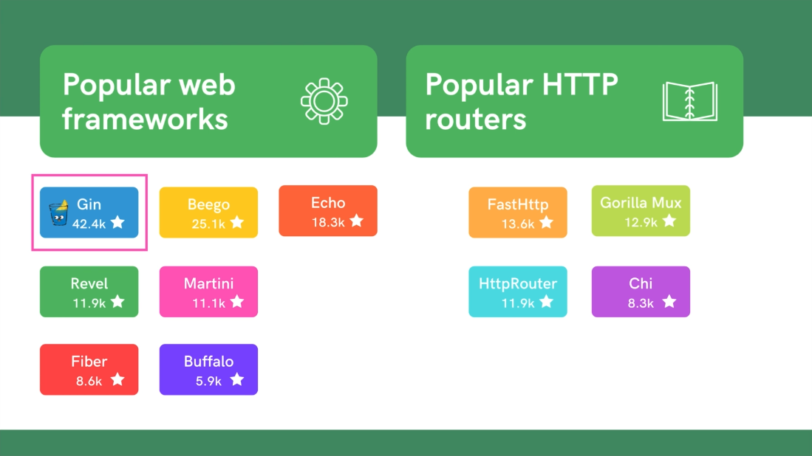

# Simple Bank

## DBDiagram.io

[DBDiagram.io](https://dbdiagram.io/d/simple-bank-660a849437b7e33fd733241e)
[TablePlus for MacOS](https://tableplus.com/download)

## Bash
- `$ mkdir -p .github/workflows`. This allows you to create a directory hierarchy with a single command. `$ mkdir -p path/to/directory`. -p stands for 'parent'.

## SQLC

- [SQLC Installation](https://docs.sqlc.dev/en/latest/overview/install.html)
  - run sqlc init to generate `sqlc.yaml` file
- [SQLC Getting Started](https://docs.sqlc.dev/en/v1.26.0/tutorials/getting-started-postgresql.html#schema-and-queries)
- [Setting up sqlc.yaml old](https://docs.sqlc.dev/en/v1.8.0/reference/config.html)
- [Setting up sqlc.yaml latest](https://docs.sqlc.dev/en/v1.26.0/reference/config.html)

- TechSchool Example implementations:
  https://github.com/techschool/simplebank/blob/master/db/query/transfer.sql
  https://github.com/techschool/simplebank/blob/master/db/query/entry.sql
  https://github.com/techschool/simplebank/blob/master/db/query/account.sql

-[lib/pq is required for postgres unit testing process](https://github.com/lib/pq)

Offset value is the number of rows skipped. It is the starting point for the cursor and SQL output

- https://reintech.io/blog/sql-offset-syntax-and-use

[Test Driven Tests in Detail](https://dave.cheney.net/2019/05/07/prefer-table-driven-tests)

## SQL 
### Deadlock and Transactions
- Locking Transactions: `# SELECT * FROM accounts WHERE id = 1 FOR UPDATE;`
  - After running this query the terminal will lock and wait for another SQL command on another terminal to run an update query e.g. (`# UPDATE accounts SET balance = 500 WHERE id = 1;`). After the update query has finished running, the `# COMMIT` command must run to unblock the initial terminal.
  - [Monitor Locked Transactions by running first query here](https://wiki.postgresql.org/wiki/Lock_Monitoring)

#### SELECT ... FOR UPDATE
`SELECT ... FOR UPDATE` is used in PostgreSQL to lock rows returned by a `SELECT` query, allowing you to perform operations on those rows within a transaction while preventing other transactions from modifying or acquiring locks on the same rows until your transaction completes. There are several scenarios where you might need to use `SELECT ... FOR UPDATE`:

1. **Implementing Transaction Isolation**: When multiple transactions need to access and modify the same rows concurrently, it's essential to ensure transaction isolation to maintain data consistency and integrity. By using `SELECT ... FOR UPDATE`, you can lock the selected rows, ensuring that other transactions cannot modify them until your transaction completes.

2. **Preventing Race Conditions**: In scenarios where multiple transactions might attempt to modify the same data simultaneously, using `SELECT ... FOR UPDATE` helps prevent race conditions. By acquiring locks on the rows you intend to modify, you ensure that your transaction has exclusive access to those rows until it completes, avoiding conflicts with other transactions.

3. **Implementing Pessimistic Locking**: Pessimistic locking is a concurrency control technique where locks are acquired on resources (rows, tables, etc.) before performing operations on them. `SELECT ... FOR UPDATE` is a way to implement pessimistic locking in PostgreSQL by explicitly locking rows for update within a transaction, ensuring that other transactions cannot modify them concurrently.

4. **Implementing Business Logic**: In some cases, your application's business logic might require exclusive access to certain rows during a transaction. For example, if you're processing orders and need to ensure that no other transactions modify the same order concurrently, you can use `SELECT ... FOR UPDATE` to lock the order rows while processing them.

5. **Avoiding Concurrent Modifications**: When you need to perform multiple operations on related rows within a transaction and want to ensure that those operations are atomic and consistent, `SELECT ... FOR UPDATE` can help avoid concurrent modifications by other transactions.

Overall, `SELECT ... FOR UPDATE` is a useful feature in PostgreSQL for managing concurrency and ensuring data consistency within transactions, especially in scenarios where multiple transactions might access or modify the same data concurrently.

[Reference](https://chat.openai.com/c/5eb9ef3b-eba5-49d3-80e7-4677f2b5dc43)

#### FOR NO KEY UPDATE;
- How `FOR NO KEY UPDATE;` can prevent deadlock in postgres

 Using `FOR NO KEY UPDATE` in PostgreSQL can prevent deadlocks by instructing the database not to acquire row-level locks when executing a `SELECT ... FOR UPDATE` query. Deadlocks often occur when multiple transactions are trying to acquire locks on rows in different orders, resulting in a circular dependency that neither transaction can break. By avoiding row-level locks with `FOR NO KEY UPDATE`, you reduce the likelihood of deadlocks because transactions won't be competing for the same locks.

Here's how it works:

1. **Locking Mechanisms**: In PostgreSQL, when you execute a `SELECT ... FOR UPDATE` statement, it locks the selected rows until the end of the transaction. This prevents other transactions from modifying or locking those rows until the first transaction releases its lock.

2. **Deadlocks**: Deadlocks occur when two transactions each hold locks that the other transaction needs to proceed. For example, Transaction A holds a lock on Row 1 and is trying to acquire a lock on Row 2, while Transaction B holds a lock on Row 2 and is trying to acquire a lock on Row 1. This creates a circular dependency, and neither transaction can proceed, resulting in a deadlock.

3. **Preventing Deadlocks with `FOR NO KEY UPDATE`**: By using `FOR NO KEY UPDATE` in your `SELECT` statement, you tell PostgreSQL not to acquire row-level locks. This means that other transactions can still acquire locks on the same rows concurrently without waiting for the first transaction to release its locks. As a result, the likelihood of deadlocks decreases because transactions are less likely to be competing for the same locks.

4. **Trade-offs**: While using `FOR NO KEY UPDATE` can help prevent deadlocks, it also means that you lose the ability to enforce exclusive access to the selected rows. If maintaining exclusive access is crucial for your application, you might need to find alternative strategies for deadlock prevention, such as careful transaction ordering or reducing the scope of transactions.

In summary, `FOR NO KEY UPDATE` can be a useful tool for preventing deadlocks in PostgreSQL by reducing the likelihood of lock contention between transactions. However, it's essential to understand the trade-offs and implications for your specific application requirements.

[Reference](https://chat.openai.com/c/5eb9ef3b-eba5-49d3-80e7-4677f2b5dc43)

## GitHub Actions 
[Github Actions Postgres](https://docs.github.com/en/actions/using-containerized-services/creating-postgresql-service-containers)

## Web Framework Implementation
- [Go Gin](https://github.com/gin-gonic/gin): The most popular Go Web Framework is Gin

- [Gin Validator Tags in structs](https://pkg.go.dev/github.com/go-playground/validator#section-readme)